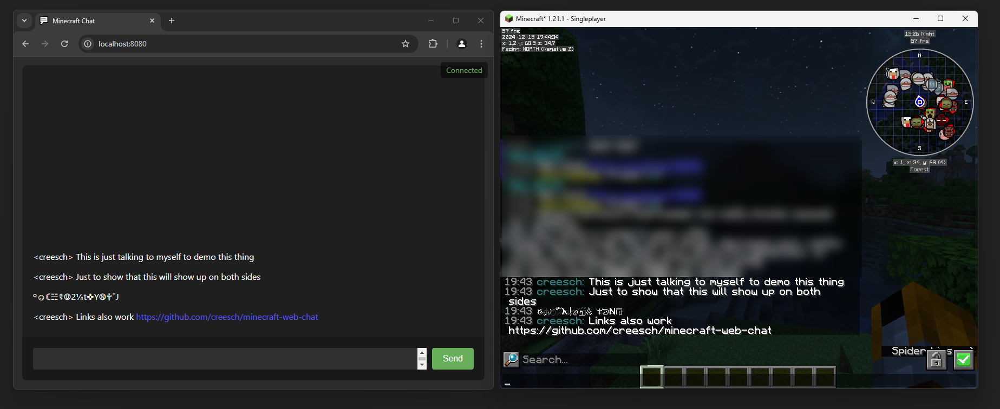

# Minecraft Web Chat mod 

Web chat is a **client only** mod giving you access to the chat of the server you are in through a browser. Allowing you to chat with other players while having minecraft in the background. Great for things like semi-afk farming and similar things!

# Features
- Access chat through any web browser.
- Full support for Minecraft's text formatting (colors, bold, italic, etc.)
- Clickable URLs in chat messages.
- Chat history is stored and available when you are on a server and open chat in a browser.
- Tab notification for new messages when the browser isn't focused.
- Fully client side, should work on any server.
- Ping support for your username & configurable keywords. 
- Support for `/tell`, `/msg`, `/w` and `/me` commands.
- Tab completion of usernames.

# Availability 

- Minecraft version: 1.21.1 and up
- Mod loader: Fabric only

There are no plans to support other mod loaders.

# Usage 

## Requirements
- [Fabric API](https://modrinth.com/mod/fabric-api) (required)
- [YACL](https://modrinth.com/mod/yacl) (required)
- [Mod Menu](https://modrinth.com/mod/modmenu) (optional, needed for configuration)

## Installation
1. Install the mod [from Modrinth](https://modrinth.com/mod/web-chat) or grab the [latest release from GitHub](https://github.com/creesch/minecraft-web-chat/releases).
2. Start minecraft.
3. Join a server.
4. Go to `localhost:8080` on the same computer, or use your computer's local IP address (like `192.168.1.x:8080`) from other devices on your network.
5. Start chatting.

## Settings 

### Message settings 

- `Ping on Username` - This will ping the browser window any time a player's username appears in the chat.
- `Extra Ping keywords` - This will ping the browser window any time one of these words appear in the chat.

### Network settings

- `HTTP Port` - Port number used to serve the web interface. `8080` by default. 

# Security & Privacy

This mod turns minecraft into a small web server on your computer that's only accessible locally (`localhost`) on your network. This means that you can access it on a different device on your network, but not from outside the internet. 
No data is sent over the internet beyond your normal Minecraft traffic. 

**Important:** This mod is designed for local use only. **Do not** expose the web chat port to the internet. If you need remote access, setup a VPN to your home network instead.
